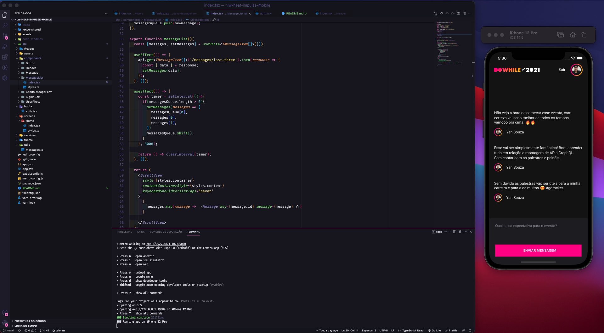

<h1>NLW Heat - React Native</h1>

  

## ✨ Tecnologias

Esse projeto foi desenvolvido com as seguintes tecnologias:

- [Expo](https://expo.dev/)
- [React Native](https://reactnative.dev/)
- [Moti](https://moti.fyi/)
- [Typescript](https://www.typescriptlang.org/)
- [Axios](https://github.com/axios/axios/blob/master/README.md)

## 💻 Projeto

Aplicação para se conectar com a comunidade e interagir sobre o evento DoWhile 2021.

## 🚀 Como executar

- Clone o repositório
- Rode `yarn` para baixar as dependências
- Rode `expo install` para baixar as dependências expo
- Rode o `expo start` para iniciar a aplicação.
- Escolha o emulador ou rodar no dispositivo fisico.
